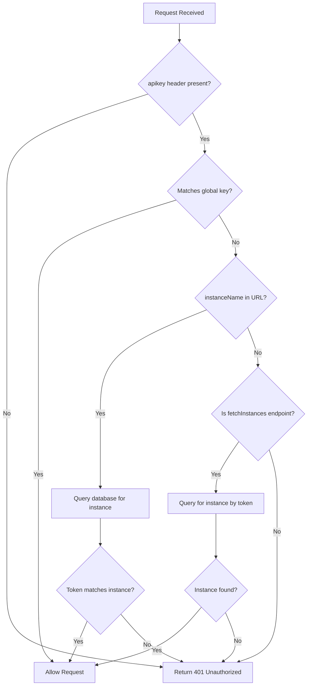

Evolution API uses API key authentication via the `apikey` header. The system supports two levels of authentication: global API keys and per-instance tokens.

## Authentication Architecture

Authentication is handled by the auth guard middleware (`src/api/guards/auth.guard.ts:10-51`) which validates every protected request.

### Two-Level Authentication

Evolution API implements a hierarchical authentication model:

1. **Global API Key**: Administrative access for creating and managing all instances
2. **Instance Tokens**: Scoped access for operations on specific instances

<Note>
  This dual-key system provides security through least-privilege access. Use instance tokens for client applications and reserve the global key for administrative operations.
</Note>

## Global API Key

The global API key provides unrestricted access to all instances and administrative operations.

### Configuration

Set the global API key using the `AUTHENTICATION_API_KEY` environment variable:

```bash .env
AUTHENTICATION_API_KEY=your-secure-global-api-key-here
```

<Warning>
  **Default Value**: If not set, the system uses `BQYHJGJHJ` as the default key. You must change this in production environments.
  
  See `src/config/env.config.ts:407` for the default configuration.
</Warning>

### Using the Global API Key

Include the global API key in the `apikey` header:

<CodeGroup>
```bash cURL
curl -X POST https://api.yourdomain.com/instance/create \
  -H "apikey: your-secure-global-api-key-here" \
  -H "Content-Type: application/json" \
  -d '{
    "instanceName": "my-instance",
    "token": "instance-specific-token",
    "qrcode": true
  }'
```

```javascript Node.js
const response = await fetch('https://api.yourdomain.com/instance/create', {
  method: 'POST',
  headers: {
    'apikey': 'your-secure-global-api-key-here',
    'Content-Type': 'application/json'
  },
  body: JSON.stringify({
    instanceName: 'my-instance',
    token: 'instance-specific-token',
    qrcode: true
  })
});

const data = await response.json();
```

```python Python
import requests

response = requests.post(
    'https://api.yourdomain.com/instance/create',
    headers={
        'apikey': 'your-secure-global-api-key-here',
        'Content-Type': 'application/json'
    },
    json={
        'instanceName': 'my-instance',
        'token': 'instance-specific-token',
        'qrcode': True
    }
)

print(response.json())
```
</CodeGroup>

### Global Key Permissions

The global API key grants access to:

- **Instance creation**: `POST /instance/create`
- **Fetch all instances**: `GET /instance/fetchInstances`
- **All instance operations**: Full CRUD on any instance
- **Administrative endpoints**: Metrics, health checks, configuration

## Instance Tokens

Each instance has a unique token that provides scoped access to only that instance's operations.

### Token Generation

Instance tokens are set during instance creation:

```json
{
  "instanceName": "customer-support",
  "token": "cs-prod-2024-secure-token",
  "qrcode": true
}
```

<ParamField path="token" type="string" required>
  A unique identifier for this instance. This becomes the instance's authentication token.
  
  **Requirements:**
  - Must be unique across all instances
  - Recommended: Use UUID or similar cryptographically random strings
  - Avoid predictable patterns for security
</ParamField>

### Using Instance Tokens

Once an instance is created, use its token for all instance-specific operations:

<CodeGroup>
```bash cURL
curl -X POST https://api.yourdomain.com/message/sendText/customer-support \
  -H "apikey: cs-prod-2024-secure-token" \
  -H "Content-Type: application/json" \
  -d '{
    "number": "5511999999999",
    "text": "Hello from Evolution API!"
  }'
```

```javascript Node.js
const response = await fetch(
  'https://api.yourdomain.com/message/sendText/customer-support',
  {
    method: 'POST',
    headers: {
      'apikey': 'cs-prod-2024-secure-token',
      'Content-Type': 'application/json'
    },
    body: JSON.stringify({
      number: '5511999999999',
      text: 'Hello from Evolution API!'
    })
  }
);

const data = await response.json();
```

```python Python
import requests

response = requests.post(
    'https://api.yourdomain.com/message/sendText/customer-support',
    headers={
        'apikey': 'cs-prod-2024-secure-token',
        'Content-Type': 'application/json'
    },
    json={
        'number': '5511999999999',
        'text': 'Hello from Evolution API!'
    }
)

print(response.json())
```
</CodeGroup>

### Token Scope and Isolation

Instance tokens are validated against the database (`src/api/guards/auth.guard.ts:30-35`):

```typescript
const instance = await prismaRepository.instance.findUnique({
  where: { name: param.instanceName },
});
if (instance.token === key) {
  return next();
}
```

<Warning>
  **Security Boundary**: Instance tokens can only access their own instance data. Attempts to access other instances will result in a 401 Unauthorized error, even with a valid token.
</Warning>

## Authentication Flow

The authentication guard implements the following flow (`src/api/guards/auth.guard.ts:10-51`):



### Authentication Priority

1. **Global API Key**: Checked first, grants immediate access if valid
2. **Instance Token**: Checked if global key doesn't match
3. **Database Validation**: Instance tokens are verified against the database

## Per-Instance Access Control

Evolution API enforces strict per-instance access control:

### Instance Name Validation

All instance-specific endpoints require the `instanceName` parameter:

```
/message/sendText/:instanceName
/chat/findChats/:instanceName
/group/create/:instanceName
```

The instance name is extracted and validated before processing (`src/api/abstract/abstract.router.ts:34`).

### Database-Level Isolation

All database queries include instance-scoped filters:

```typescript
const messages = await prismaRepository.message.findMany({
  where: {
    instanceId: instance.id  // Always filter by instance
  }
});
```

<Note>
  This architecture ensures complete data isolation between tenants, even in the event of application-level bugs.
</Note>

## Common Authentication Scenarios

### Scenario 1: Administrative Dashboard

Use the global API key for administrative interfaces:

```javascript
// Create new instance for customer
const createInstance = async (customerName) => {
  const response = await fetch('/instance/create', {
    headers: { 'apikey': GLOBAL_API_KEY },
    method: 'POST',
    body: JSON.stringify({
      instanceName: `customer-${customerName}`,
      token: generateSecureToken(),
      qrcode: true
    })
  });
  return response.json();
};
```

### Scenario 2: Client Application

Provide instance tokens to client applications:

```javascript
// Client receives their instance token
const INSTANCE_TOKEN = 'customer-xyz-token';
const INSTANCE_NAME = 'customer-xyz';

// Send messages using instance token
const sendMessage = async (number, text) => {
  const response = await fetch(
    `/message/sendText/${INSTANCE_NAME}`,
    {
      headers: { 'apikey': INSTANCE_TOKEN },
      method: 'POST',
      body: JSON.stringify({ number, text })
    }
  );
  return response.json();
};
```

### Scenario 3: Multi-Instance Management

Use the global key to manage multiple instances:

```javascript
// Fetch all instances
const instances = await fetch('/instance/fetchInstances', {
  headers: { 'apikey': GLOBAL_API_KEY }
});

// Operate on specific instances
for (const instance of instances) {
  await fetch(`/instance/connectionState/${instance.name}`, {
    headers: { 'apikey': GLOBAL_API_KEY }
  });
}
```

## Authentication Error Responses

Evolution API returns specific error responses for authentication failures:

### Missing API Key

**Request:**
```bash
GET /instance/connectionState/my-instance
# Missing apikey header
```

**Response (401):**
```json
{
  "status": 401,
  "error": "Unauthorized",
  "message": "Unauthorized"
}
```

See `src/exceptions/401.exception.ts:3-11` for the exception implementation.

### Invalid API Key

**Request:**
```bash
GET /instance/connectionState/my-instance
apikey: invalid-key-here
```

**Response (401):**
```json
{
  "status": 401,
  "error": "Unauthorized",
  "message": "Unauthorized"
}
```

### Wrong Instance Token

**Request:**
```bash
POST /message/sendText/instance-a
apikey: instance-b-token

{ "number": "123", "text": "test" }
```

**Response (401):**
```json
{
  "status": 401,
  "error": "Unauthorized",
  "message": "Unauthorized"
}
```

### Missing Global Key for Administrative Operations

**Request:**
```bash
POST /instance/create
apikey: some-instance-token

{ "instanceName": "new-instance" }
```

**Response (403):**
```json
{
  "status": 403,
  "error": "Forbidden",
  "message": [
    "Missing global api key",
    "The global api key must be set"
  ]
}
```

See `src/exceptions/403.exception.ts:3-11` for the Forbidden exception.

## Verifying Credentials

Test your authentication credentials using the verify endpoint:

```bash
POST /verify-creds
apikey: your-api-key
```

**Success Response (200):**
```json
{
  "status": 200,
  "message": "Credentials are valid",
  "facebookAppId": "...",
  "facebookConfigId": "...",
  "facebookUserToken": "..."
}
```

This endpoint is defined in `src/api/routes/index.router.ts:207-216`.

## Security Best Practices

<Warning>
  Follow these security guidelines to protect your Evolution API deployment:
</Warning>

### 1. Secure API Key Generation

Generate cryptographically secure API keys:

```javascript
// Node.js example
const crypto = require('crypto');
const apiKey = crypto.randomBytes(32).toString('hex');
```

```python
# Python example
import secrets
api_key = secrets.token_hex(32)
```

### 2. Environment Variable Management

Never commit API keys to version control:

```bash
# .env (not committed)
AUTHENTICATION_API_KEY=production-secure-key-here

# .env.example (committed)
AUTHENTICATION_API_KEY=change-this-in-production
```

### 3. Key Rotation

Implement regular key rotation:

- **Global keys**: Rotate quarterly or after team changes
- **Instance tokens**: Rotate when clients request or after security events
- **Process**: Create new key → update clients → revoke old key

### 4. HTTPS Only

Always use HTTPS in production to prevent key interception:

```bash
SERVER_TYPE=https
SERVER_URL=https://api.yourdomain.com
```

### 5. IP Allowlisting

Restrict API access to known IP addresses at the infrastructure level (reverse proxy, firewall, or API gateway).

### 6. Monitor Authentication Failures

Log and alert on repeated authentication failures:

```typescript
// The auth guard logs errors
logger.error(error);  // src/api/guards/auth.guard.ts:47
```

### 7. Instance Token Management

Control instance token visibility:

```bash
# Hide tokens in fetchInstances response
AUTHENTICATION_EXPOSE_IN_FETCH_INSTANCES=false
```

When set to `false`, the `/instance/fetchInstances` endpoint will not return instance tokens in the response.

## Next Steps

<CardGroup cols={2}>
  <Card title="Error Handling" icon="triangle-exclamation" href="/api/errors">
    Learn about authentication error codes and troubleshooting
  </Card>
  
  <Card title="Create Instance" icon="plus" href="/api/instance/create">
    Create your first WhatsApp instance
  </Card>
  
  <Card title="API Overview" icon="book" href="/api/overview">
    Return to API overview
  </Card>
  
  <Card title="Security" icon="shield" href="/concepts/authentication">
    Read the full security documentation
  </Card>
</CardGroup>